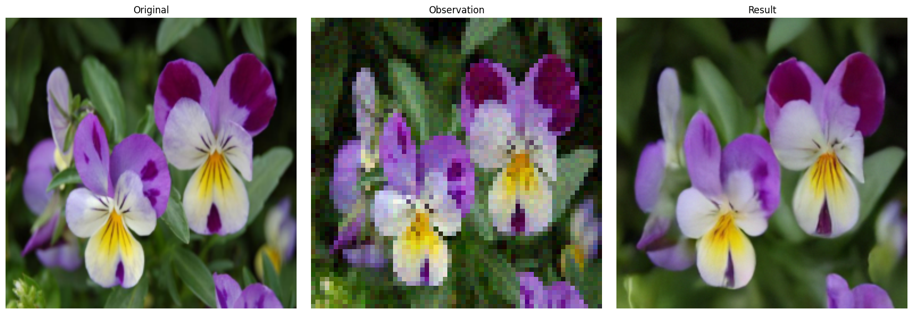

# Sequential Monte Carlo Sampling of Diffusion Models

Joint project work with Simon Queric

## Structure of the repository
### `MCGDiff_GMM`: Monte Carlo Guided Diffusion for bayesian linear inverse problems on a Gaussian Mixture Model
### `TDS_GMM`: Twisted Diffusion Sampling for (blind) inverse problems on a Gaussian Mixture Model
### `TDS_images`: Twisted Diffusion Sampling for (blind) inverse problems on images

<figure>
  
  <figcaption> TDS sampling for super-resolution. </figcaption>
</figure>

## Requirements
Depending on the specific folder, the requirements are different. 
## References

[1] G. Cardoso, Y. J. E. Idrissi, S. L. Corff, and E. Moulines. Monte carlo guided diffusion for
bayesian linear inverse problems, 2023.

[2] H. Chung, J. Kim, M. T. Mccann, M. L. Klasky, and J. C. Ye. Diffusion posterior sampling for
general noisy inverse problems, 2023.

[3] J. Ho, A. Jain, and P. Abbeel. Denoising diffusion probabilistic models, 2020.

[4] J. Song, A. Vahdat, M. Mardani, and J. Kautz. Pseudoinverse-guided diffusion models for inverse
problems. In International Conference on Learning Representations, 2023.

[5] Y. Song, J. Sohl-Dickstein, D. P. Kingma, A. Kumar, S. Ermon, and B. Poole. Score-based
generative modeling through stochastic differential equations, 2021.

[6] L. Wu, B. L. Trippe, C. A. Naesseth, D. M. Blei, and J. P. Cunningham. Practical and asymptoti-
cally exact conditional sampling in diffusion models, 2023
